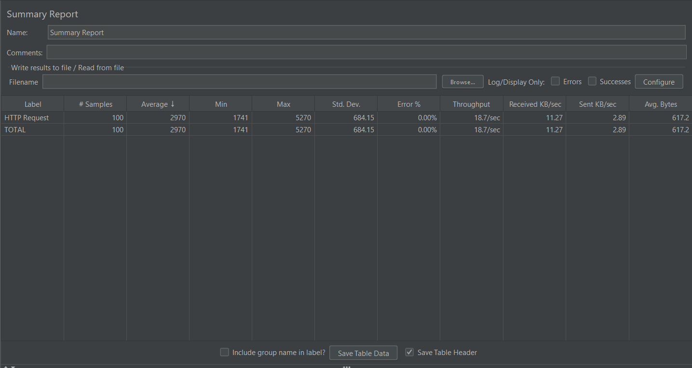

# Desafio técnico Engenheiro de QA - Guia de Motéis - Performance.

Este é o repositório do desafio técnico Engenheiro de QA para o Guia de Motéis utilizando JMeter. Este documento fornece informações sobre o projeto, como executá-lo, plano e estratégia de testes.

## Índice
1. [Sobre o Projeto](#sobre-o-projeto)
2. [Resultados](#resultados)
3. [Autor](#autor)

## Sobre o Projeto

Este projeto utiliza o JMeter para realizar testes de Performance. O objetivo deste projeto é garantir que a API mock esteja funcionando conforme o esperado. Além de demonstrar os conhecimento técnicos do autor em testes de performance.

## Resultados

Conforme dados extraídos do JMeter, a API mock, sob carga de 100 usuários simultâneos, teve um tempo de resposta médio de 2970 ms, não apresentou nenhum erro ou falha de requisição  e o sistema manteve-se estável.

| Label | # Samples | Average | Min | Max | Std. Dev. | Error % | Throughput | Received KB/sec | Sent KB/sec | Avg. Bytes |
|--|--|--|--|--|--|--|--|--|--|--|
| TOTAL | 100 | 2970 | 1741 | 5270 | 684.15 | 0.000% | 18.69858 | 11.27 | 2.89 | 617.2 |

**Ambiente de Teste**

| **Ferramenta**      | **Versão** |
|---------------------|------------|
| JMeter              | 5.6.3      |
| Postman Server Mock | 11.8       |

## Autor
* **Luan Castro**
   * [GitHub](https://github.com/Luancsn14)
   * [LinkedIn](https://www.linkedin.com/in/luan-castro-18a4636a/)
